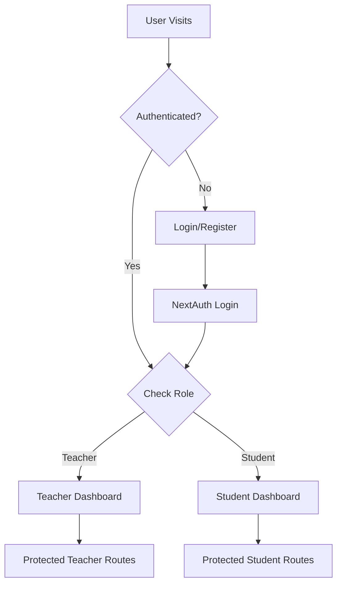

# 🎓 Educational Platform - Complete Architecture

## 📊 Project Overview
A modern, AI-powered educational platform with separate Teacher and Student dashboards, featuring live virtual classrooms, smart attendance tracking, and an intelligent AI assistant.

---

## 🏗️ Tech Stack

### Frontend
- **Framework**: Next.js 14 (App Router)
- **Styling**: Tailwind CSS + ShadCN UI
- **State Management**: Zustand
- **Animations**: Framer Motion
- **Forms**: React Hook Form + Zod
- **Theme**: next-themes
- **Charts**: Recharts
- **i18n**: next-intl

### Backend
- **API**: Next.js API Routes
- **Database**: MongoDB + Mongoose
- **Auth**: NextAuth.js (JWT)
- **File Storage**: AWS S3 / Cloudinary

### Third-Party Services
- **Live Classroom**: LiveKit Cloud (Video, Audio, Chat, Whiteboard)
- **AI**: Groq API (Llama 3, Mixtral)
- **Real-time**: WebSockets / Server-Sent Events

---

## 📁 Project Structure

```
web-a-thon/
├── src/
│   ├── app/
│   │   ├── (auth)/
│   │   │   ├── login/
│   │   │   │   └── page.tsx
│   │   │   └── register/
│   │   │       └── page.tsx
│   │   ├── (teacher)/
│   │   │   ├── teacher/
│   │   │   │   ├── dashboard/
│   │   │   │   │   └── page.tsx
│   │   │   │   ├── class/
│   │   │   │   │   └── [id]/
│   │   │   │   │       └── page.tsx
│   │   │   │   ├── session/
│   │   │   │   │   └── [id]/
│   │   │   │   │       └── page.tsx
│   │   │   │   └── layout.tsx
│   │   ├── (student)/
│   │   │   ├── student/
│   │   │   │   ├── dashboard/
│   │   │   │   │   └── page.tsx
│   │   │   │   ├── session/
│   │   │   │   │   └── [id]/
│   │   │   │   │       └── page.tsx
│   │   │   │   └── layout.tsx
│   │   ├── ai-assistant/
│   │   │   └── page.tsx
│   │   ├── api/
│   │   │   ├── auth/
│   │   │   │   └── [...nextauth]/
│   │   │   │       └── route.ts
│   │   │   ├── teacher/
│   │   │   │   ├── classes/
│   │   │   │   │   └── route.ts
│   │   │   │   ├── subjects/
│   │   │   │   │   └── route.ts
│   │   │   │   ├── sessions/
│   │   │   │   │   └── route.ts
│   │   │   │   ├── materials/
│   │   │   │   │   └── route.ts
│   │   │   │   └── attendance/
│   │   │   │       └── route.ts
│   │   │   ├── student/
│   │   │   │   ├── classes/
│   │   │   │   │   └── route.ts
│   │   │   │   ├── sessions/
│   │   │   │   │   └── route.ts
│   │   │   │   └── attendance/
│   │   │   │       └── route.ts
│   │   │   ├── livekit/
│   │   │   │   ├── token/
│   │   │   │   │   └── route.ts
│   │   │   │   └── webhook/
│   │   │   │       └── route.ts
│   │   │   ├── ai/
│   │   │   │   ├── chat/
│   │   │   │   │   └── route.ts
│   │   │   │   ├── quiz/
│   │   │   │   │   └── route.ts
│   │   │   │   └── summarize/
│   │   │   │       └── route.ts
│   │   │   └── upload/
│   │   │       └── route.ts
│   │   ├── layout.tsx
│   │   └── globals.css
│   ├── components/
│   │   ├── ui/
│   │   │   ├── button.tsx
│   │   │   ├── card.tsx
│   │   │   ├── dialog.tsx
│   │   │   ├── dropdown-menu.tsx
│   │   │   ├── input.tsx
│   │   │   ├── select.tsx
│   │   │   ├── table.tsx
│   │   │   └── ...
│   │   ├── layouts/
│   │   │   ├── TeacherLayout.tsx
│   │   │   ├── StudentLayout.tsx
│   │   │   ├── Sidebar.tsx
│   │   │   ├── Topbar.tsx
│   │   │   └── BottomNav.tsx
│   │   ├── teacher/
│   │   │   ├── CreateClassDialog.tsx
│   │   │   ├── CreateSubjectDialog.tsx
│   │   │   ├── ScheduleSessionDialog.tsx
│   │   │   ├── AttendanceTable.tsx
│   │   │   ├── MaterialUploader.tsx
│   │   │   └── ClassCard.tsx
│   │   ├── student/
│   │   │   ├── ClassOverview.tsx
│   │   │   ├── SubjectList.tsx
│   │   │   ├── SessionCard.tsx
│   │   │   ├── AttendanceHistory.tsx
│   │   │   └── PerformanceDashboard.tsx
│   │   ├── livekit/
│   │   │   ├── VideoRoom.tsx
│   │   │   ├── ParticipantView.tsx
│   │   │   ├── ChatPanel.tsx
│   │   │   ├── Whiteboard.tsx
│   │   │   ├── ScreenShare.tsx
│   │   │   └── RaiseHandButton.tsx
│   │   ├── ai/
│   │   │   ├── ChatInterface.tsx
│   │   │   ├── QuizGenerator.tsx
│   │   │   ├── DoubtThread.tsx
│   │   │   └── SummaryCard.tsx
│   │   ├── shared/
│   │   │   ├── ThemeToggle.tsx
│   │   │   ├── LanguageSelector.tsx
│   │   │   ├── LoadingSpinner.tsx
│   │   │   ├── ErrorBoundary.tsx
│   │   │   └── ProtectedRoute.tsx
│   │   └── charts/
│   │       ├── AttendanceChart.tsx
│   │       ├── PerformanceChart.tsx
│   │       └── LeaderboardChart.tsx
│   ├── lib/
│   │   ├── mongodb.ts
│   │   ├── auth.ts
│   │   ├── livekit.ts
│   │   ├── groq.ts
│   │   ├── utils.ts
│   │   └── validations.ts
│   ├── models/
│   │   ├── User.ts
│   │   ├── Class.ts
│   │   ├── Subject.ts
│   │   ├── Session.ts
│   │   ├── Attendance.ts
│   │   ├── Message.ts
│   │   ├── Material.ts
│   │   ├── Quiz.ts
│   │   ├── Performance.ts
│   │   └── Doubt.ts
│   ├── store/
│   │   ├── authStore.ts
│   │   ├── classStore.ts
│   │   ├── sessionStore.ts
│   │   └── themeStore.ts
│   ├── hooks/
│   │   ├── useAuth.ts
│   │   ├── useLiveKit.ts
│   │   ├── useAI.ts
│   │   └── useAttendance.ts
│   ├── types/
│   │   ├── index.ts
│   │   ├── models.ts
│   │   └── api.ts
│   └── middleware.ts
├── public/
│   ├── icons/
│   └── images/
├── .env.local
├── .env.example
├── next.config.js
├── tailwind.config.js
├── tsconfig.json
├── package.json
└── README.md
```

---

## 🎨 Design System

### Color Palette
```css
:root {
  /* Primary */
  --primary: 263 70% 50%;
  --primary-foreground: 0 0% 100%;
  
  /* Background */
  --background: 0 0% 100%;
  --foreground: 240 10% 3.9%;
  
  /* Muted */
  --muted: 240 4.8% 95.9%;
  --muted-foreground: 240 3.8% 46.1%;
  
  /* Accent */
  --accent: 240 4.8% 95.9%;
  --accent-foreground: 240 5.9% 10%;
  
  /* Success */
  --success: 142 76% 36%;
  
  /* Warning */
  --warning: 38 92% 50%;
  
  /* Error */
  --destructive: 0 84% 60%;
}

.dark {
  --background: 240 10% 3.9%;
  --foreground: 0 0% 98%;
  --muted: 240 3.7% 15.9%;
  --muted-foreground: 240 5% 64.9%;
  /* ... */
}
```

### Typography
- **Font**: Inter (system font fallback)
- **Headings**: font-bold
- **Body**: font-normal
- **Scale**: text-xs, text-sm, text-base, text-lg, text-xl, text-2xl, text-3xl, text-4xl

### Spacing
- **Base unit**: 4px (1 = 4px, 2 = 8px, 4 = 16px, etc.)
- **Common spacing**: p-4, p-6, gap-4, space-y-6

### Shadows
- **sm**: 0 1px 2px 0 rgba(0, 0, 0, 0.05)
- **DEFAULT**: 0 1px 3px 0 rgba(0, 0, 0, 0.1)
- **md**: 0 4px 6px -1px rgba(0, 0, 0, 0.1)
- **lg**: 0 10px 15px -3px rgba(0, 0, 0, 0.1)
- **xl**: 0 20px 25px -5px rgba(0, 0, 0, 0.1)

### Border Radius
- **Default**: rounded-lg (0.5rem)
- **Cards**: rounded-xl (0.75rem)
- **Buttons**: rounded-md (0.375rem)
- **Full**: rounded-full

---

## 📱 Responsive Breakpoints

```javascript
const breakpoints = {
  sm: '640px',   // Mobile landscape
  md: '768px',   // Tablet
  lg: '1024px',  // Desktop
  xl: '1280px',  // Large desktop
  '2xl': '1536px' // Extra large
}
```

### Layout Strategy
- **Mobile First**: Base styles for mobile, enhance for larger screens
- **Teacher Dashboard**: 
  - Mobile: Single column, hamburger menu
  - Tablet+: Sidebar + main content
- **Student Dashboard**:
  - Mobile: Bottom navigation
  - Desktop: Left sidebar

---

## 🔐 Authentication Flow



### Middleware Protection
```typescript
// middleware.ts
export function middleware(request: NextRequest) {
  const token = request.cookies.get('next-auth.session-token')
  const path = request.nextUrl.pathname
  
  if (path.startsWith('/teacher') && role !== 'teacher') {
    return NextResponse.redirect('/login')
  }
  
  if (path.startsWith('/student') && role !== 'student') {
    return NextResponse.redirect('/login')
  }
}
```

---

## 🎥 LiveKit Integration Flow

### Room Creation (Teacher)
1. Teacher schedules session
2. Backend creates LiveKit room
3. Generate unique room name: `class-{classId}-session-{sessionId}`
4. Store room metadata in Session document

### Joining Room
1. User clicks "Join Session"
2. Frontend requests access token from `/api/livekit/token`
3. Backend validates user + session
4. Generate LiveKit token with:
   - Identity: `{role}-{userId}`
   - Room name
   - Permissions (teacher: all, student: limited)
5. Frontend connects with LiveKit React SDK

### Attendance Tracking
1. LiveKit webhook → `/api/livekit/webhook`
2. Events:
   - `participant_joined` → Log join time
   - `participant_left` → Log leave time, calculate duration
3. Store in Attendance collection

---

## 🤖 AI Integration (Groq)

### Chat System
```typescript
// Groq API Call
const response = await groq.chat.completions.create({
  messages: [
    {
      role: "system",
      content: `You are a helpful ${subject} teacher for Class ${className}.
                Use simple language. Respond in ${language}.`
    },
    ...chatHistory,
    { role: "user", content: userQuestion }
  ],
  model: "llama-3.1-70b-versatile",
  temperature: 0.7,
  max_tokens: 1024,
})
```

### Context Enhancement
- Pass subject info
- Include uploaded materials
- Reference previous doubts
- Student performance data

### Features
1. **Homework Helper**: Explains concepts, doesn't solve directly
2. **Quiz Generator**: Creates MCQs from chapter content
3. **Summary Generator**: Converts lecture transcript → notes
4. **Doubt Solver**: Answers student questions with context
5. **Multilingual**: Auto-detects or uses user preference

---

## 📊 Performance & Optimization

### Image Optimization
- Use Next.js `<Image>` component
- Lazy loading
- WebP format
- Responsive sizes

### Code Splitting
- Dynamic imports for heavy components
- Route-based splitting (automatic with App Router)
- Lazy load LiveKit components

### Caching Strategy
- Static pages: `export const revalidate = 3600` (1 hour)
- Dynamic data: React Query / SWR with stale-while-revalidate
- MongoDB: Index frequently queried fields

### Bundle Size
- Tree shaking (automatic)
- Remove unused dependencies
- Use lightweight alternatives where possible

---

## 🔒 Security Best Practices

1. **Authentication**
   - JWT with short expiry (15 min access, 7 day refresh)
   - HTTP-only cookies
   - CSRF protection

2. **Authorization**
   - Role-based access control (RBAC)
   - Route protection middleware
   - API endpoint validation

3. **Data Validation**
   - Zod schemas on frontend + backend
   - Sanitize user inputs
   - MongoDB injection prevention

4. **LiveKit Security**
   - Short-lived tokens (1 hour max)
   - Room-specific permissions
   - Webhook signature verification

5. **Environment Variables**
   - Never commit .env files
   - Use different keys per environment
   - Rotate secrets regularly

---

## 🚀 Deployment Strategy

### Development
```bash
npm run dev
```

### Production Build
```bash
npm run build
npm run start
```

### Recommended Platforms
- **Frontend + Backend**: Vercel (seamless Next.js deployment)
- **Database**: MongoDB Atlas (free tier)
- **File Storage**: Cloudinary (generous free tier)
- **LiveKit**: LiveKit Cloud (free tier: 50 rooms, 5000 minutes)

### Environment Setup
```env
# Database
MONGODB_URI=

# Auth
NEXTAUTH_URL=
NEXTAUTH_SECRET=

# LiveKit
LIVEKIT_API_KEY=
LIVEKIT_API_SECRET=
LIVEKIT_URL=

# Groq
GROQ_API_KEY=

# File Upload
CLOUDINARY_CLOUD_NAME=
CLOUDINARY_API_KEY=
CLOUDINARY_API_SECRET=
```

---

## 📈 Analytics & Monitoring

### Metrics to Track
- User engagement (session duration, frequency)
- Attendance rates
- Quiz performance
- AI chat usage
- Feature adoption

### Tools
- Vercel Analytics (built-in)
- Google Analytics 4
- Sentry (error tracking)
- LogRocket (session replay)

---

## 🧪 Testing Strategy

### Unit Tests
- Utility functions
- API route handlers
- Validation schemas

### Integration Tests
- Auth flow
- CRUD operations
- LiveKit integration

### E2E Tests
- User journeys (Playwright)
- Critical paths (login → join session → attendance)

---

## 📚 Documentation

### Code Documentation
- JSDoc for complex functions
- README per major feature
- API documentation (Swagger/OpenAPI)

### User Documentation
- Teacher onboarding guide
- Student user manual
- FAQ section
- Video tutorials

---

## 🎯 Success Metrics

### Technical
- Page load time < 2s
- Time to Interactive < 3s
- 99.9% uptime
- Zero critical security vulnerabilities

### Product
- 90%+ attendance accuracy
- 80%+ user satisfaction
- Average session rating > 4/5
- AI response accuracy > 85%

---

## 🔄 Future Enhancements

### Phase 4+
- Mobile apps (React Native)
- Offline mode support
- Advanced analytics (ML-based insights)
- Parent portal
- Integration with LMS (Moodle, Canvas)
- Voice commands
- AR/VR classroom experiences
- Blockchain certificates
